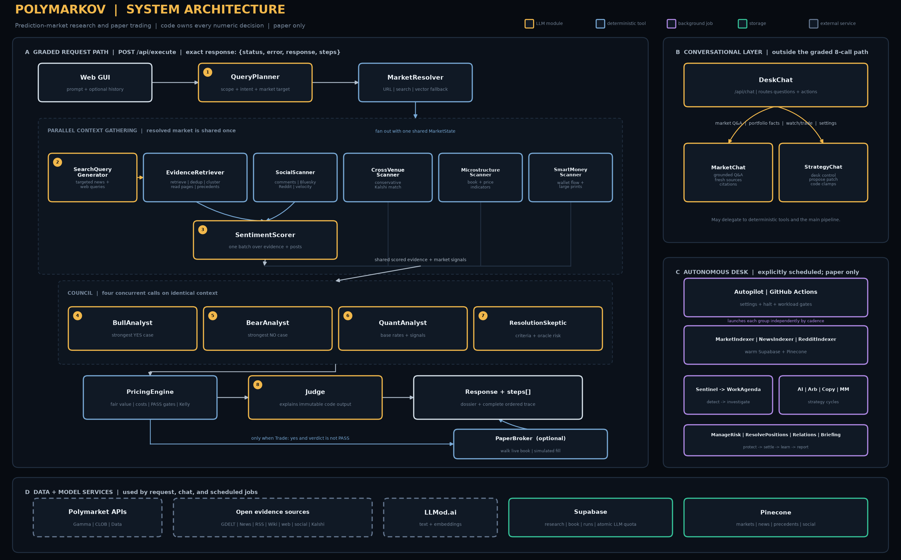

# Polymarkov

Polymarkov is an AI research and paper-trading desk for active Polymarket prediction markets. Give it a market URL, slug, or plain-English question and it produces an auditable pre-trade dossier: live market data, recent evidence, social discussion, cross-venue context, microstructure signals, four independent analyst views, a deterministic fair value, and a `BUY_YES`, `BUY_NO`, or `PASS` verdict.

The project is educational. It never submits a real-money order and it is not financial advice.

- Repository: [github.com/Dekel-E/polymarkov](https://github.com/Dekel-E/polymarkov)
- Detailed architecture: [docs/ARCHITECTURE.md](docs/ARCHITECTURE.md)
- API entry point: [api/index.py](api/index.py)
- Canonical module registry: [backend/agent/registry/tools.py](backend/agent/registry/tools.py)

## Contents

- [What Polymarkov does](#what-polymarkov-does)
- [Product surfaces](#product-surfaces)
- [Architecture](#architecture)
- [Agent execution flow](#agent-execution-flow)
- [Deterministic pricing and risk gates](#deterministic-pricing-and-risk-gates)
- [Strategies and paper portfolio](#strategies-and-paper-portfolio)
- [Data sources and graceful degradation](#data-sources-and-graceful-degradation)
- [Course API contract](#course-api-contract)
- [Additional API reference](#additional-api-reference)
- [Prompting the agent](#prompting-the-agent)
- [Technology stack](#technology-stack)
- [Local setup](#local-setup)
- [Storage setup](#storage-setup)
- [Running the project](#running-the-project)
- [Background jobs and autonomy](#background-jobs-and-autonomy)
- [Testing and verification](#testing-and-verification)
- [Deployment](#deployment)
- [Repository layout](#repository-layout)
- [Safety and operating limits](#safety-and-operating-limits)
- [Troubleshooting](#troubleshooting)
- [Submission checklist](#submission-checklist)
- [Team](#team)

## What Polymarkov does

A full analysis can:

- Resolve one active Polymarket market from a URL, slug, or free-text query.
- Read the live midpoint, bid/ask spread, order-book depth, and seven-day price history.
- Gather relevant reporting from GDELT, Google News, curated RSS feeds, Wikipedia, and open-web search.
- Gather Polymarket comments, Bluesky posts, and Reddit posts.
- Compare the event with a conservatively matched Kalshi market when one exists.
- Compute deterministic order-book, momentum, volatility, trend, and RSI signals.
- Surface followed-wallet and leaderboard activity in the selected market.
- Score all gathered evidence in one batched sentiment call.
- Run a four-persona council: Bull, Bear, Quant, and Resolution Skeptic.
- Compute fair value, execution costs, edge, verdict, and quarter-Kelly sizing in Python.
- Write a cited dossier and expose every LLM/tool step for inspection.
- Optionally simulate the resulting trade against the current CLOB ladder.

The central design rule is:

> LLMs read, classify, and argue. Deterministic code performs all pricing, fee, edge, verdict, and sizing arithmetic.

The Judge can explain a result, but it cannot change the numbers produced by the pricing engine.

## Product surfaces

The root URL has no login or registration screen, as required by the course specification.

| Route | Purpose |
|---|---|
| `/` | Main agent prompt, conversation history, complete execution trace, and active-market browser. |
| `/market/[slug]` | Live market detail, resolution criteria, recent headlines, full analysis, market Q&A, watch controls, and manual paper trading. |
| `/portfolio` | Starting bankroll, equity, available cash, exposure, lifetime P&L, open positions, partial/full closes, stop-loss/take-profit levels, market-making quotes, and trade history. |
| `/strategies` | Strategy switches, risk limits, desk chat, latest briefing, activity feed, and on-demand arbitrage scanner. |
| `/watchlist` | Watched markets and their latest cached verdicts. A schedule must be enabled separately for automatic refreshes. |
| `/league` | Polymarket profit leaderboard, wallet position inspection, and followed-wallet management for copy trading. |
| `/agent` | Run statistics, verdict distribution, latency, calibration/Brier metrics, architecture explanation, and operating limits. |

The shared DeskChat can route a message to market research, market Q&A, a paper trade, watchlist management, portfolio facts, strategy control, agent metadata, or a scoped refusal.

## Architecture



At a high level:

```text
Next.js GUI
    |
    v
FastAPI /api/execute
    |
    v
Query planning -> market resolution -> evidence/social/market tools
    |
    v
Four-persona council -> deterministic pricing -> Judge dossier
    |
    +--> response + complete steps[] trace
    |
    +--> optional PaperBroker simulation

Storage: Supabase rows + Pinecone vectors
Automation: local autopilot or manually enabled GitHub Actions schedules
```

The frontend is a Next.js App Router application. The backend is a FastAPI application deployed through a single Vercel Python function. Business logic lives under `backend/`; `api/index.py` is intentionally a thin HTTP layer.

### Naming invariant

Module names must match in all three places:

1. The `steps[]` trace returned by `/api/execute`.
2. The architecture PNG returned by `/api/model_architecture`.
3. The canonical registry in `backend/agent/registry/tools.py`.

After changing a module name or architecture stage, regenerate the image:

```powershell
.venv\Scripts\python -m scripts.gen_architecture_png
```

`GET /api/agent_info` serves the registry and prompt files from source at request time. Its example runs are frozen recordings in `backend/assets/agent_examples.json`; refresh them after a material pipeline change with `scripts.record_examples`.

## Agent execution flow

A normal, uncached full run uses eight logical LLM modules. Tool stages are also added to the trace, so a typical full `steps[]` array contains more than eight entries.

| Order | Module | Kind | Responsibility |
|---:|---|---|---|
| 1 | `QueryPlanner` | LLM | Checks scope and extracts the target market, requested focus, language, and paper-trade intent. |
| 2 | `MarketResolver` | Tool | Resolves a direct slug/URL, Gamma search result, or Pinecone fallback and loads live market state. |
| 3 | `SearchQueryGenerator` | LLM | Produces focused news, web, and Wikipedia queries. |
| 4 | `EvidenceRetriever` | Tool | Retrieves, filters, deduplicates, clusters, reads, and caches relevant evidence and precedents. |
| 5 | `SocialScanner` | Tool | Collects market comments, Bluesky, Reddit, and mention velocity. |
| 6 | `CrossVenueScanner` | Tool | Searches for a conservative Kalshi match. |
| 7 | `MicrostructureScanner` | Tool | Computes book imbalance, micro-price, banded depth, spread, momentum, volatility, SMA trend, and RSI. |
| 8 | `SmartMoneyScanner` | Tool | Measures followed/top-wallet activity, net flow, and large prints in the market. |
| 9 | `SentimentScorer` | LLM | Scores all evidence and posts in one batch; skipped when there is nothing to score. |
| 10-13 | `BullAnalyst`, `BearAnalyst`, `QuantAnalyst`, `ResolutionSkeptic` | Four concurrent LLM calls | Produce independent, structured opinions over the same shared evidence. |
| 14 | `PricingEngine` | Tool | Computes fair value, edge, pass reasons, verdict, and position size deterministically. |
| 15 | `Judge` | LLM | Writes the final dossier around the immutable computed result. |
| 16 | `PaperBroker` | Optional tool | Walks the live book and records a simulated fill only when a trade was requested and the verdict is not `PASS`. |

The eight full-run LLM modules are `QueryPlanner`, `SearchQueryGenerator`, `SentimentScorer`, the four council analysts, and `Judge`.

Short-circuits intentionally cost less:

- A 15-minute dossier cache hit uses zero LLM calls.
- A meta or out-of-scope request normally stops after `QueryPlanner`.
- Empty evidence skips `SentimentScorer`.
- Invalid model JSON gets at most one traced repair attempt.
- Council personas run concurrently, reducing wall-clock latency.

Every LLM call goes through `RunContext.call_llm`, which applies the timeout, records the prompts and response even on failure, and performs the single allowed JSON repair attempt. Immediately before every physical provider request, `backend/llm/budget.py` atomically reserves one slot in Supabase. The counter is global across API instances, chats, jobs, concurrent council calls, JSON repairs, provider fallbacks, and embedding batches. A configured deployment fails closed if the counter is unavailable; standalone development without Supabase uses a clearly reported process-local fallback. The entire `/api/execute` operation has a 270-second application deadline, below Vercel's 300-second function limit.

## Deterministic pricing and risk gates

The pricing engine is implemented in `backend/agent/pricing.py`.

1. The market midpoint is clamped to `[0.02, 0.98]` and converted to log odds.
2. Council evidence weights are deduplicated across personas.
3. Correlated evidence inside the same cluster is discounted.
4. The total log-odds update is capped.
5. Resolution risk shrinks the estimate back toward the market prior.
6. Net edge subtracts half the spread, modeled taker fees, slippage, and a two-point safety margin.
7. A valid directional edge is sized with quarter Kelly and capped at 5% of bankroll.

The modeled fee is category-specific and uses `rate * price * (1 - price)`. These are simulation assumptions in `backend/config.py`, not a promise about future Polymarket fees; recheck them before any deployment demonstration.

The engine returns `PASS` when any hard gate fails, including:

- High resolution risk.
- Missing or overly wide order book (`> 0.08` spread by default).
- Fewer than two independent evidence clusters.
- Council probability disagreement greater than `0.25`.
- Less than `$2,000` of ask-side depth for the proposed token.
- Non-positive edge after modeled costs and the safety margin.

`PASS` is a successful risk decision, not an agent failure.

## Strategies and paper portfolio

All strategies are simulations. Nothing in this repository signs or submits a real Polymarket transaction.

| Strategy | How it works | Important limitation |
|---|---|---|
| AI signal | Runs the complete research pipeline and trades only a non-`PASS` deterministic verdict. | Directional model and evidence risk remain. |
| Arbitrage | Scans complete YES/NO baskets and mutually exclusive outcome baskets priced below their payout. | Execution re-runs a fresh server scan, preflights every leg at one share count, and records the entire basket atomically; otherwise no leg is recorded. |
| Copy trading | Mirrors newly observed positions from followed wallets once, scaled to the paper bankroll and capped. | The source wallet may have changed its view before observation; exits follow Polymarkov's rules, not the source wallet. |
| Market making | Simulates two-sided quotes, settles a quote only after a trade-through, caps inventory, and stops near resolution. | One side can fill without the other; adverse-selection and inventory risk remain. |
| Correlation graph | Uses an LLM to propose strict implication/exclusion relations, then checks prices mechanically. | It is not risk-free: the projected payout depends on the inferred logical relation being correct. |

### Atomic arbitrage execution

The browser cannot define an arbitrary basket and label it arbitrage. `POST /api/arbitrage/execute` first looks for the same basket in a fresh server-side scan. The executor then:

- Refreshes every required token book.
- Requires the complete common share count to remain available.
- Recomputes VWAP and modeled fees.
- Aborts if the edge disappeared.
- Inserts all position rows in one PostgreSQL multi-row operation.

This prevents the paper portfolio from recording one hedge leg without the others.

### Default desk settings

| Setting | Default | Editable bounds |
|---|---:|---:|
| Starting bankroll | `$10,000` | `$100` to `$1,000,000` |
| Stop loss | `50%` of stake | `5%` to `95%` |
| Take profit | `100%` of stake | `10%` to `500%` |
| Maximum autonomous position | `$500` | `$10` to `$2,000` |
| Maximum open positions | `10` | `1` to `50` |
| Daily loss halt | `$300` | `$10` to `$5,000` |

AI signal, arbitrage, and correlation scanning are enabled by default. Copy trading and market making are disabled by default. Strategy switches configure behavior but do not start a scheduler.

The risk manager:

- Enforces global percentage stops or explicit per-position price levels.
- Includes realized daily losses plus negative open P&L in the circuit breaker.
- Does not allow unrealized gains to cancel realized losses.
- Resets an automatic halt on a new UTC day, or allows a manual resume.
- Records one equity snapshot per UTC day when migration `0015` is installed.
- Disables an autonomous strategy after at least five seven-day trades and at least `$50` of realized loss, without using an LLM.

Changing the starting bankroll does not delete positions or P&L. Use the reset script when a genuinely clean portfolio is required.

## Data sources and graceful degradation

| Data | Source |
|---|---|
| Markets, metadata, events | Polymarket Gamma API |
| Books and price history | Polymarket CLOB API |
| Wallet activity and leaderboard | Polymarket Data API |
| News | GDELT, Google News RSS, curated RSS feeds |
| Background/reference context | Wikipedia |
| Open-web fallback | DuckDuckGo HTML search |
| Social | Polymarket comments, Bluesky, Reddit |
| Cross-venue price | Kalshi public search |
| Row storage | Supabase/PostgreSQL |
| Vector retrieval | Pinecone |
| Text and embeddings | LLMod.ai through an OpenAI-compatible client |

External sources are best-effort. A blocked or empty source contributes no evidence instead of crashing the whole run. Supabase and Pinecone helpers also degrade to safe empty reads/no-op writes when unconfigured.

That degraded mode is useful for development, but the complete submitted product should configure all three service layers:

- LLMod for analysis, chat, and embeddings.
- Supabase for persistence, cache, portfolio, settings, automation, and reporting.
- Pinecone for market/news/precedent/social vector retrieval.

The Pinecone index is cosine, dimension `1536` by default, serverless on AWS `us-east-1`, with four namespaces: `markets`, `news`, `precedents`, and `social`.

## Course API contract

These names and response shapes are grading-sensitive.

### `GET /api/team_info`

Returns exactly:

```json
{
  "group_batch_order_number": "batch1_order1",
  "team_name": "Polymarkov Team",
  "students": [
    { "name": "Dekel Elimelech", "email": "dekele@campus.technion.ac.il" },
    { "name": "Rom Katav", "email": "rom.katav@campus.technion.ac.il" },
    { "name": "Omer Perchuk", "email": "omer.perchuk@campus.technion.ac.il" }
  ]
}
```

### `GET /api/agent_info`

Returns the agent description, purpose, prompt template, frozen prompt examples with full responses and steps, canonical module names, tool registry, and current prompt files.

### `GET /api/model_architecture`

Returns `backend/assets/architecture.png` with `Content-Type: image/png`.

### `POST /api/execute`

Required request:

```json
{
  "prompt": "Market: fed-decision-in-september\nFocus: all\nTrade: no"
}
```

An optional `history` array of up to 12 `{role, content}` objects supports follow-up context.

Successful response top-level fields are exactly:

```json
{
  "status": "ok",
  "error": null,
  "response": "<final dossier>",
  "steps": [
    {
      "module": "QueryPlanner",
      "prompt": {
        "system_prompt": "...",
        "user_prompt": "..."
      },
      "response": {}
    }
  ]
}
```

Errors use the same HTTP-200 course envelope:

```json
{
  "status": "error",
  "error": "Human-readable error",
  "response": null,
  "steps": []
}
```

The root GUI calls `/api/execute?ui=1`, which adds a structured `ui` payload for rendering cards. The unflagged endpoint keeps the exact four-field course response.

### Grader smoke test

Set `BASE` to the Vercel deployment, or `http://localhost:3000` while both local development servers are running:

```bash
BASE=https://your-deployment.example

curl -fsS "$BASE/api/team_info"
curl -fsS "$BASE/api/agent_info"
curl -fsS "$BASE/api/model_architecture" -o architecture.png
curl -fsS -X POST "$BASE/api/execute" \
  -H "Content-Type: application/json" \
  -d '{"prompt":"Market: fed-decision-in-september\nFocus: all\nTrade: no"}'
```

## Additional API reference

Unless noted otherwise, GUI support endpoints return a domain payload plus an `error` field.

### Markets and research

| Method | Path | Input | Purpose |
|---|---|---|---|
| `GET` | `/api/markets?limit=20` | `limit: 1..500` | Active markets ordered by recent volume; server-cached for 30 seconds. |
| `GET` | `/api/search?q=...&limit=12` | `limit: 1..20` | Search active Polymarket markets. |
| `GET` | `/api/market?slug=...` | Market slug | Live market state, book, depth, and history. |
| `GET` | `/api/market/news?slug=...&limit=10` | `limit: 1..15` | Relevant indexed and live headlines. |
| `POST` | `/api/market/chat` | `{slug, question, history?}` | Grounded market Q&A with citations and optional fresh search. |
| `POST` | `/api/chat` | `{question, history?, slug?}` | Global DeskChat router. |

### Portfolio and risk

| Method | Path | Input | Purpose |
|---|---|---|---|
| `GET` | `/api/portfolio` | - | Open/resolved paper positions, lifetime statistics, and equity history. |
| `POST` | `/api/trade` | `{slug, side, size_usd}` | Manual paper fill; side is `BUY_YES`/`BUY_NO`, size is `> 0` and `<= 1000`. |
| `POST` | `/api/position/close` | `{position_id, fraction}` | Close `0 < fraction <= 1` against the current book. |
| `PUT` | `/api/position/limits` | `{position_id, sl_price?, tp_price?}` | Set/clear token-price stop and take-profit levels between 0 and 1. |
| `GET` | `/api/quotes` | - | Open simulated market-making quotes. |
| `POST` | `/api/quotes/cancel` | `{quote_id}` | Cancel a pending simulated quote. |
| `GET` | `/api/settings` | - | Strategies, risk rules, halt state, bankroll, and realized P&L today. |
| `PUT` | `/api/settings` | Partial `{strategies, risk, halt, funds}` | Apply a whitelisted and clamped settings patch. The GUI can resume but cannot arm a halt through this endpoint. |
| `POST` | `/api/strategy/chat` | `{question, history?}` | Explain or modify desk settings in natural language. |

### Strategies, wallets, and operations

| Method | Path | Input | Purpose |
|---|---|---|---|
| `GET` | `/api/arbitrage?fresh=false` | `fresh` boolean | Scan qualifying baskets; cached for three minutes unless refreshed. |
| `POST` | `/api/arbitrage/execute` | `{opportunity}` | Freshly revalidate and atomically record a complete paper basket. |
| `GET` | `/api/league?window=30d` | `1d`, `7d`, `30d`, or `all` | Top wallets by reported profit. |
| `GET` | `/api/league/wallet?address=...` | Wallet address | Current wallet positions. |
| `GET` | `/api/wallets` | - | Followed wallets. |
| `POST` | `/api/wallets` | `{wallet, label?}` | Follow one valid EVM wallet. |
| `DELETE` | `/api/wallets?wallet=...` | Wallet address | Unfollow a wallet. |
| `POST` | `/api/wallets/import` | `{wallets: [...]}` | Validate and bulk-follow addresses/labels. |
| `GET` | `/api/watchlist` | - | Watched markets with cached verdicts. |
| `POST` | `/api/watchlist` | `{market_id}` | Add a market. |
| `DELETE` | `/api/watchlist?market_id=...` | Market slug | Remove a market. |
| `GET` | `/api/agenda` | - | Pending sentinel work items. |
| `GET` | `/api/briefing` | - | Latest daily briefing. |
| `GET` | `/api/activity?limit=25` | `limit: 1..50` | Recent analyses, trades, and settlements. |
| `GET` | `/api/agent/stats` | - | Run history, verdict distribution, latency, and calibration. |
| `GET` | `/api/health` | - | Deployment readiness, schema version, dependency configuration, and current global LLM budget. Returns `503` when core dependencies are not ready. |

Calibration reports both run-level metrics and a preferred latest-forecast-per-resolved-market view, so repeatedly analyzing one event cannot masquerade as many independent wins. It includes agent/market Brier and log loss, Brier skill versus the contemporaneous market, expected calibration error, fixed probability buckets, resolution coverage, and an explicit warning while the resolved-market sample is small.

## Prompting the agent

The most reliable prompt format is:

```text
Market: <Polymarket URL, slug, or plain-English market question>
Focus: <all | news | socials | resolution>
Trade: <yes | no>
```

Examples:

```text
Market: Will the Federal Reserve cut rates at the next meeting?
Focus: all
Trade: no
```

```text
Market: https://polymarket.com/event/<event>/<market-slug>
Focus: resolution
Trade: no
```

```text
Market: <active-market-slug>
Focus: news
Trade: yes
```

`Trade: yes` authorizes only a simulated paper fill and still respects the deterministic `PASS` decision. Avoid vague prompts such as "what should I buy?"; naming one active market produces a more reliable and cheaper run.

DeskChat supports shorter operational messages such as:

- `What is my available cash and largest open position?`
- `Watch this market.` when used from a market page.
- `Buy $50 YES.` when used from a market page.
- `Set the stop loss to 30%.`
- `Turn off copy trading.`
- `Why did the last analysis pass?`

## Technology stack

- Python 3.12
- FastAPI 0.115 and Pydantic 2
- OpenAI-compatible Python client for LLMod.ai
- Supabase/PostgreSQL
- Pinecone serverless vector database
- Next.js 16 App Router
- React 19 and TypeScript 5
- Tailwind CSS 3
- Pytest, pytest-asyncio, and respx
- GitHub Actions CI and optional scheduled jobs
- Vercel serverless deployment

Course model defaults:

- Text: `MB5R2CF-azure/gpt-5.4-mini`
- Embeddings: `MB5R2CF-azure/text-embedding-3-small`
- Embedding dimension: `1536`

An OpenAI-compatible provider can be substituted in local development by overriding the model/base URL variables. The submitted configuration should use the course-provided LLMod models and remain within the shared `$13` course budget.

## Local setup

### Prerequisites

- Git
- Python 3.12
- Node.js 22 and npm
- PowerShell for the included two-server Windows helper
- LLMod credentials for full analysis
- Supabase and Pinecone credentials for complete persistence/RAG behavior

### Clone

```powershell
git clone https://github.com/Dekel-E/polymarkov.git
cd polymarkov
```

### Windows setup

```powershell
Copy-Item .env.example .env
python -m venv .venv
.venv\Scripts\python -m pip install -r requirements-dev.txt
npm ci
```

Edit `.env` and fill the required service credentials. The project includes a minimal `.env` loader; no extra dotenv package is required.

### macOS/Linux setup

The npm helper scripts for starting FastAPI use a Windows virtual-environment path, so run the servers manually on Unix-like systems:

```bash
cp .env.example .env
python3.12 -m venv .venv
.venv/bin/python -m pip install -r requirements-dev.txt
npm ci
```

### Environment variables

Never commit `.env` or service-role credentials.

| Variable | Required | Default | Purpose |
|---|---|---|---|
| `LLMOD_API_KEY` | Full pipeline | - | Shared LLMod/OpenAI-compatible API key. |
| `LLMOD_BASE_URL` | Full pipeline | - | OpenAI-compatible API base URL. |
| `LLM_GLOBAL_DAILY_REQUEST_LIMIT` | No | `150` | Atomic UTC-day cap shared by all text requests, retries, and embedding batches. |
| `LLM_MODEL` | No | Course text model | Text-generation model override. |
| `EMBEDDING_MODEL` | No | Course embedding model | Embedding model override. |
| `EMBEDDING_DIM` | No | `1536` | Must match the Pinecone index dimension. |
| `SUPABASE_URL` | Persistence | - | Supabase project URL. |
| `SUPABASE_SERVICE_KEY` | Persistence | - | Server-side service-role key. Never expose it to browser code. |
| `PINECONE_API_KEY` | Vector RAG | - | Pinecone API key. |
| `PINECONE_INDEX` | No | `polymarkov` | Pinecone index name. |
| `REDDIT_CLIENT_ID` | No | Keyless search | Enables Reddit OAuth when paired with the secret. |
| `REDDIT_CLIENT_SECRET` | No | Keyless search | Enables Reddit OAuth when paired with the client ID. |

Polymarket, Kalshi, Google News, GDELT, Wikipedia, RSS, Bluesky, and the fallback web search do not require project API keys.

## Storage setup

### Supabase

1. Create a Supabase project.
2. Copy the project URL and service-role key into `.env`.
3. Open the Supabase SQL editor.
4. Run every file in `supabase/migrations/` in numeric order from `0001` through `0017`.

Migration responsibilities:

| Migration | Adds |
|---|---|
| `0001` | Active market cache. |
| `0002` | Indexed articles. |
| `0003` | Resolved-market precedents. |
| `0004` | Paper positions and status index. |
| `0005` | Agent run history and cost/latency fields. |
| `0006` | Compatibility `user_id` column/index for positions; the product remains a single shared desk. |
| `0007` | Dossier/intelligence cache. |
| `0008` | Watchlist, run market IDs, and resolution timestamps. |
| `0009` | Followed wallets. |
| `0010` | Agent settings, strategy attribution, and copied-trade deduplication. |
| `0011` | Autonomous agenda and daily briefings. |
| `0012` | Market-making quotes and logical market relations. |
| `0013` | Market-making placement midpoint and reward-score metadata. |
| `0014` | Per-position stop-loss and take-profit price levels. |
| `0015` | Daily equity snapshots. |
| `0016` | Indexed social posts. |
| `0017` | Atomic global LLM quota, usage telemetry, and deployment health RPC. |

The migrations are idempotent (`if not exists`) and are designed to be applied in order. A `PGRST205` or "table not installed" message means the connected database is behind the repository; apply the missing migrations and allow Supabase's schema cache to refresh.

### Pinecone

Set `PINECONE_API_KEY` and optionally `PINECONE_INDEX`. The first vector write creates the index automatically if it does not exist, using cosine similarity, dimension `EMBEDDING_DIM`, AWS, and `us-east-1`.

If an existing index was created with a different dimension, use a new index name or recreate it. Changing only `EMBEDDING_DIM` cannot make an incompatible existing index usable.

### Initial data population

Every command supports a non-writing preview where shown:

```powershell
# Confirm external access and candidate counts without writes
.venv\Scripts\python -m jobs.index_markets --top 100 --dry-run
.venv\Scripts\python -m jobs.index_news --markets 10 --dry-run
.venv\Scripts\python -m jobs.index_social --markets 10 --dry-run
.venv\Scripts\python -m scripts.seed_precedents --count 50 --skip-history --dry-run

# Populate the full stores
.venv\Scripts\python -m jobs.index_markets --top 500
.venv\Scripts\python -m jobs.index_news --markets 20
.venv\Scripts\python -m jobs.index_social --markets 15
.venv\Scripts\python -m scripts.seed_precedents --count 250
```

The precedent backfill can take time because it optionally retrieves historical prices. `--skip-history` is faster but omits `final_mid_7d_before` context.

## Running the project

### Windows: start both development servers

```powershell
npm run up
```

This clears stale listeners and starts:

- FastAPI on `http://127.0.0.1:8000`
- Next.js on `http://localhost:3000`

In development, Next.js proxies `/api/*` to port `8000`.

Stop both servers with:

```powershell
npm run down
```

### Start manually

Windows, in two terminals:

```powershell
npm run dev:api
```

```powershell
npm run dev
```

macOS/Linux, in two terminals:

```bash
.venv/bin/python -m uvicorn api.index:app --reload --port 8000
```

```bash
npm run dev
```

Open `http://localhost:3000`.

`npm start` alone is not a unified local production server: the `/api/*` proxy exists only in Next.js development, while Vercel uses `vercel.json` to route APIs to `api/index.py`.

### Verify the local services

```powershell
Invoke-RestMethod http://127.0.0.1:8000/api/team_info
Invoke-RestMethod http://127.0.0.1:8000/api/markets?limit=3
Invoke-WebRequest http://localhost:3000
```

### Reset the paper portfolio

The reset removes positions, mirrored-trade records, simulated market-making quotes, and equity snapshots. It restores the `$10,000` starting bankroll and releases an active risk halt.

It preserves watchlists, followed wallets, indexed research, run history, strategy switches, and risk limits.

```powershell
# Read-only preview
.venv\Scripts\python -m scripts.reset_portfolio

# Destructive reset after reviewing the preview
.venv\Scripts\python -m scripts.reset_portfolio --confirm RESET
```

## Background jobs and autonomy

Strategy switches do not create schedules. Autonomy must be started explicitly through the local autopilot or enabled GitHub Actions cron blocks.

| Job | LLM use | Default local cadence | Purpose |
|---|---:|---:|---|
| `jobs.manage_risk` | None | 30 min | Stops/targets, circuit breaker, equity snapshot, and strategy tuning. |
| `jobs.index_markets` | Embeddings | 2 h | Index active markets into Supabase/Pinecone. |
| `jobs.index_news` | Embeddings | 2 h | Index market-relevant news. |
| `jobs.index_social` | Embeddings | 2 h | Index Reddit posts for tracked markets. |
| `jobs.sentinel` | None | 1 h | File agenda items for moves, drawdowns, deadlines, news bursts, and new listings. |
| `jobs.work_agenda` | Full pipeline when needed | 1 h | Investigate the highest-priority agenda items and act under risk limits. |
| `jobs.market_maker` | None | 1 h | Settle trade-throughs and refresh eligible simulated quotes. |
| `jobs.auto_trade` | Full pipeline | 4 h | Analyze eligible markets and trade only real modeled edge. |
| `jobs.refresh_watchlist` | Full pipeline | 4 h | Refresh expired watched-market dossiers without trading. |
| `jobs.scan_arbitrage` | None | 4 h | Detect and atomically record qualifying paper baskets. |
| `jobs.copy_trade` | None | 4 h | Mirror newly observed followed-wallet positions. |
| `jobs.resolve_positions` | Embeddings | Daily | Resolve finished paper positions and add precedents. |
| `jobs.build_relations` | One batched LLM call | Daily | Build high-confidence implication/exclusion links. |
| `jobs.daily_briefing` | One LLM call | Daily | Write a book, risk, and agenda summary. |
| `jobs.watch_live` | None | Persistent | React to live book updates; requires a persistent host. |

### Local autopilot

Preview one complete pass without writes/trades:

```powershell
.venv\Scripts\python -m jobs.autopilot --once --dry-run
```

Run one real pass:

```powershell
.venv\Scripts\python -m jobs.autopilot --once
```

Run continuously until `Ctrl+C`:

```powershell
.venv\Scripts\python -m jobs.autopilot
```

Each job runs in a subprocess with a 15-minute timeout, so one failure does not stop the desk. In dry-run mode, `manage_risk` is skipped because it always writes and has no dry-run flag.

### GitHub Actions

- `ci.yml`: runs on pushes and pull requests.
- `indexers.yml`: market/news/social indexing and resolution.
- `automation.yml`: risk, AI trading, watchlist, arbitrage, and copy trading.
- `autonomy.yml`: sentinel, agenda worker, market maker, relations, and briefing.

Automation workflows are manual-only in the repository. Their cron blocks are intentionally commented out for grading and cost control. To enable them, uncomment the desired `schedule` entries and add all required credentials under repository **Settings -> Secrets and variables -> Actions**.

The agenda worker still stops after 40 recorded analyses per UTC day as a workload-specific guard. In addition, migration `0017` enforces `LLM_GLOBAL_DAILY_REQUEST_LIMIT` before every provider request across all API routes and jobs. The PostgreSQL reservation is atomic, so concurrent workers cannot race past the limit. Keep schedules manual until expected usage has been estimated against the course allowance.

## Testing and verification

Run the complete local verification suite:

```powershell
.venv\Scripts\python -m pytest backend/tests -q
npx tsc --noEmit
npm run lint
npm run build
npm audit --omit=dev
```

Useful focused commands:

```powershell
.venv\Scripts\python -m pytest backend/tests/test_pipeline.py -q
.venv\Scripts\python -m pytest backend/tests/test_api_contract.py -q
.venv\Scripts\python -m pytest backend/tests/test_pricing.py -q
```

CI runs Python 3.12 and Node 22, installs with `pip`/`npm ci`, and executes tests, TypeScript, lint, and the production build.

The tests cover the graded envelopes and exact field sets, module naming, eight-call full flow, cache short-circuits, evidence handling, deterministic pricing, trade fills, atomic arbitrage, portfolio accounting, risk rules, chat routing, storage degradation, automation, and external API parsers with mocked responses.

Re-recording `backend/assets/agent_examples.json` makes real LLM calls and should be done deliberately:

```powershell
.venv\Scripts\python -m scripts.record_examples --slug <active-market-slug>
```

The recorder requires a successful complete analysis with the expected tool stages and also records one out-of-scope refusal.

## Deployment

Polymarkov is designed for Vercel:

1. Import `https://github.com/Dekel-E/polymarkov` into Vercel.
2. Add the variables from `.env.example` to the Vercel project.
3. Apply all Supabase migrations and verify the Pinecone dimension first.
4. Deploy from the repository root.
5. Verify `GET /api/health` returns `200`, `ready: true`, and schema version `0017`.
6. Verify the root GUI and all four required course endpoints.
7. Keep the Vercel project/account active until grading is complete.

`vercel.json`:

- Rewrites `/api/*` to the Python FastAPI entry point.
- Sets the function maximum duration to 300 seconds.

`/api/execute` uses a 270-second internal timeout so it can return the required error envelope before the platform terminates the function.

Vercel functions must not run background loops. Use GitHub Actions or `jobs.autopilot` on a persistent host for indexing and automation. `jobs.watch_live` specifically needs a process that can keep a WebSocket open and is not suitable for Vercel or short-lived Actions jobs.

After deployment, perform a production smoke test with:

```bash
BASE=https://your-vercel-domain
curl -f "$BASE/"
curl -f "$BASE/api/health"
curl -f "$BASE/api/team_info"
curl -f "$BASE/api/agent_info"
curl -f "$BASE/api/model_architecture" -o architecture.png
curl -f -X POST "$BASE/api/execute" \
  -H "Content-Type: application/json" \
  -d '{"prompt":"Market: <active-market-slug>\nFocus: all\nTrade: no"}'
```

## Repository layout

```text
polymarkov/
|-- api/index.py                    FastAPI routes and Vercel entry point
|-- app/                            Next.js pages
|-- components/                     Reusable desk UI
|-- lib/                            Frontend API client and TypeScript contracts
|-- backend/
|   |-- agent/                      Pipeline, council, chat, pricing, registry
|   |-- data/                       Polymarket/news/social/Supabase/Pinecone clients
|   |-- llm/                        OpenAI-compatible LLM and embedding wrappers
|   |-- sim/                        Broker, portfolio, risk, arbitrage, MM, relations
|   |-- assets/                     Architecture PNG and frozen examples
|   `-- tests/                      Backend and contract test suite
|-- jobs/                           Indexing, strategy, risk, and autonomy processes
|-- scripts/                        Reset, examples, precedents, architecture helpers
|-- supabase/migrations/            Ordered PostgreSQL schema migrations
|-- docs/ARCHITECTURE.md            Detailed system walkthrough
|-- .github/workflows/              CI and opt-in automation workflows
|-- next.config.ts                  Development API proxy
`-- vercel.json                     Production API rewrite and timeout
```

## Safety and operating limits

- Paper trading only; no wallet private keys or transaction signing code.
- No authentication, by explicit course requirement.
- Single shared desk and paper book, not a multi-tenant system.
- The Supabase service-role key is server-only and must never be prefixed with `NEXT_PUBLIC_`.
- Manual trade requests are capped at `$1,000` by the API.
- Autonomous directional trades respect the configurable maximum-position rule.
- Arbitrage legs have a separate `$100`-per-leg cap and execute only as a verified complete paper basket.
- Strategy automation is disabled until explicitly scheduled.
- Evidence and web content are treated as untrusted input; prompt instructions inside sources are ignored.
- The agent may be wrong. A fair-value estimate is a model output, not a factual probability or guarantee.

The no-auth requirement is appropriate for this isolated educational paper-trading project. Before adapting the code to any public or multi-user service, add authentication, authorization, per-user data isolation, rate limits, CSRF protection, secrets hardening, observability, and abuse controls.

## Troubleshooting

### The GUI loads but `/api/*` fails locally

Both development servers are required. Run `npm run up`, or start FastAPI on `8000` and Next.js on `3000` separately. `npm start` does not enable the development proxy.

If a route exists in source but returns 404 on Windows, an old Uvicorn process may still own port `8000`. Run:

```powershell
npm run down
npm run up
```

### Full analysis says the LLM is not configured

Set both `LLMOD_API_KEY` and `LLMOD_BASE_URL` in `.env`. Restart the backend after changing environment variables.

### Portfolio, watchlist, settings, or briefings are empty

Confirm `SUPABASE_URL` and `SUPABASE_SERVICE_KEY`, then apply all migrations. Without Supabase, live research can degrade gracefully but persistent desk state cannot.

### `PGRST205`, "table not installed," or missing equity/social data

The database schema is behind the code. Apply the missing migration files in numeric order. Equity history requires `0015`, stored social posts require `0016`, and the global quota plus deployment-health RPC require `0017`.

### Analysis says the global LLM budget is unavailable or exhausted

If it says unavailable, install `0017_global_llm_budget.sql` in the same Supabase project referenced by `SUPABASE_URL`, then restart the backend. If it says exhausted, either wait for the UTC-day reset or deliberately adjust `LLM_GLOBAL_DAILY_REQUEST_LIMIT`; do not bypass the reservation in code. Check current usage with `GET /api/health`.

### Pinecone reports a vector dimension error

The existing index dimension differs from `EMBEDDING_DIM`. Restore `1536`, select a compatible model, or create a new index name.

### No arbitrage opportunities appear

That is normal. The scanner returns only complete baskets that clear the configured edge and liquidity thresholds. Empty results are safer than manufacturing an opportunity.

### An arbitrage opportunity disappears when executed

Execution intentionally performs another server-side scan and refreshes every required book. If the basket no longer qualifies, no position rows are recorded.

### News or social sections are thin

Sources are best-effort and may rate-limit serverless IPs. Google News/RSS/Wikipedia and Bluesky/Polymarket/Reddit are combined so one unavailable provider does not break the run. Configure Reddit OAuth and run the indexers for a warmer cache.

### Open-position marks are stale

Portfolio marks come from the latest indexed market values and can be up to the index cadence old. Run `jobs.index_markets` or enable the indexer schedule.

### GitHub workflows do not run on a schedule

This is intentional. The checked-in cron entries are commented out. Use `workflow_dispatch` or explicitly uncomment the schedules after configuring secrets and reviewing cost.

### The architecture endpoint is missing or names drift

Regenerate the checked-in PNG and run the contract tests:

```powershell
.venv\Scripts\python -m scripts.gen_architecture_png
.venv\Scripts\python -m pytest backend/tests/test_api_contract.py -q
```

## Submission checklist

- [ ] Root Vercel URL opens the GUI immediately with no authentication.
- [ ] `GET /api/team_info` contains the official names/emails and presentation batch/order number.
- [ ] `GET /api/agent_info` includes description, purpose, prompt template, full recorded examples, and steps.
- [ ] `GET /api/model_architecture` returns a clear PNG.
- [ ] Module names match the registry, trace, and PNG.
- [ ] `POST /api/execute` returns exactly `{status, error, response, steps}` without `?ui=1`.
- [ ] The GUI displays the response and full module/prompt/response trace.
- [ ] All 17 Supabase migrations are installed.
- [ ] `GET /api/health` returns `200`, `ready: true`, schema `0017`, and a global budget status.
- [ ] Pinecone uses the configured embedding dimension.
- [ ] LLMod uses the course models and remains within budget.
- [ ] `pytest`, TypeScript, lint, and production build pass.
- [ ] Frozen examples still match the current pipeline.
- [ ] Paper portfolio is reset if a clean grading state is desired.
- [ ] Vercel production smoke test passes and remains active through grading.
- [ ] Submission contains both the Vercel URL and GitHub repository URL.

## Team

**Team:** Polymarkov Team

**Presentation order:** `batch1_order1`

| Student | Official email |
|---|---|
| Dekel Elimelech | dekele@campus.technion.ac.il |
| Rom Katav | rom.katav@campus.technion.ac.il |
| Omer Perchuk | omer.perchuk@campus.technion.ac.il |

## Disclaimer

Polymarkov is an educational research and paper-trading simulator. Prediction markets are uncertain, external evidence can be incomplete or incorrect, logical market relationships can be misclassified, and modeled fills/fees may differ from real execution. Do not treat any output as financial advice or a guarantee of profit.
