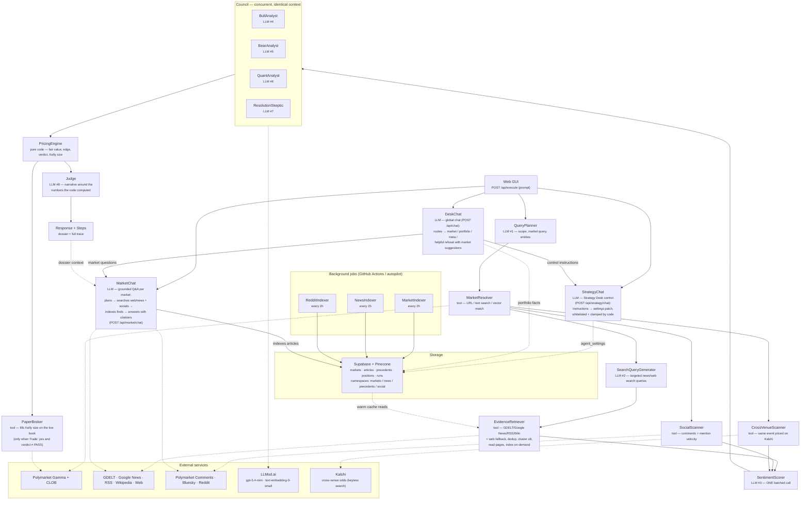

# Polymarkov — Architecture

This document explains the **entire flow** of a Polymarkov run: what happens
from the moment a prompt hits `/api/execute` to the verdict and paper trade
that come back, plus the conversational and autonomous layers that reuse the
same machinery.

**One load-bearing rule governs everything:** the LLM never computes a number.
LLMs *judge, read, and argue*; deterministic Python does *all* arithmetic
(fair value, edge, verdict, Kelly size). This makes every run reproducible and
auditable, and immune to a model hallucinating a probability.

One full `/api/execute` run invokes **8 logical LLM modules** (amber below).
If a model returns invalid JSON, its repair attempt is traced as an additional
call. Module names here are identical to the `steps[]` trace and the PNG served at
`/api/model_architecture` — they must never drift (see *Naming invariant*).

---

## The execute flow, step by step

The request path is orchestrated by [backend/agent/orchestrator.py](../backend/agent/orchestrator.py);
each stage lives in [backend/agent/pipeline.py](../backend/agent/pipeline.py).
Every LLM call goes through `RunContext.call_llm` ([backend/llm/client.py](../backend/llm/client.py)),
which records the step (even on failure), retries invalid JSON exactly once,
and enforces the timeout. Below that logical-call layer, every physical chat
request, retry, compatibility fallback, and embedding batch atomically reserves
one slot through [backend/llm/budget.py](../backend/llm/budget.py). PostgreSQL
migration `0017` makes the quota shared across every web instance and job; a
configured deployment fails closed if that shared counter is unavailable.
Tool steps are recorded via `add_tool_step`.

**0. Entry & envelope.** `POST /api/execute {prompt, history?}` calls
`run_pipeline`, which wraps the whole thing so a pipeline exception becomes a
`status:"error"` envelope (never an HTTP 500), plus a 270s `asyncio.wait_for`
so Vercel's 300s kill can't win. The response is always exactly
`{status, error, response, steps}`; the GUI opts into an extra structured `ui`
payload with `?ui=1`.

**Cache short-circuit.** Before any LLM call, a 15-minute dossier cache
([backend/agent/intel_cache.py](../backend/agent/intel_cache.py)) is checked.
A hit returns the full dossier with **zero LLM calls**.

**1. QueryPlanner (LLM #1).** Parses the prompt into a structured plan:
`in_scope`, `intent` (market / meta / out_of_scope), the market query or URL,
and entities. Out-of-scope or meta prompts short-circuit here (1 call) — a
"write me a poem" prompt gets a scoped refusal, not a pipeline run.

**2. MarketResolver (tool).** Turns the query into a concrete market:
a Polymarket URL is parsed directly; otherwise text search against Gamma, then
a Pinecone vector match as a fallback. Returns the live market state (mid,
spread, order book) from the CLOB.

**3. Evidence gathering.** First, **SearchQueryGenerator (LLM #2)** turns the
market question, resolution criteria, and extracted entities into targeted
news/web search queries (falling back to entity-based queries if it fails).
Then three tools run in parallel:
- **EvidenceRetriever** — runs those queries against GDELT, Google News RSS,
  curated RSS feeds,
  and Wikipedia (all keyless; the RSS/Wiki set works where GDELT's IP block
  bites), with a DuckDuckGo web fallback. It dedups, clusters into ≤8 topics,
  reads the underlying pages, and **indexes everything it fetches** back into
  Supabase tagged with the market slug — so future runs and the vector index
  can retrieve it.
- **SocialScanner** — Polymarket comments, Bluesky (keyless), and Reddit, plus
  mention-velocity signal. Reddit is scraped from the category's relevant
  subreddits (e.g. r/Economics, r/CryptoCurrency, r/PredictionMarkets) via the
  keyless search **RSS** feed with a browser User-Agent — Reddit hard-403s its
  JSON endpoints from datacenter IPs — or the OAuth JSON API when Reddit
  credentials are set. Tops up from the warm `social_posts` cache when live
  scrapes run thin.
- **CrossVenueScanner** — finds the same event priced on Kalshi, giving the
  council a second market-consensus prior.
- **MicrostructureScanner** *(deterministic — no LLM)* — computes order-book and
  price-action indicators from the full ladder MarketResolver already fetched:
  book imbalance, micro-price, banded depth, spread %, 24h/7d momentum,
  volatility, trend (SMA), RSI. Code does every number; the QuantAnalyst only
  interprets them.
- **SmartMoneyScanner** *(deterministic — no LLM)* — checks whether tracked
  (followed) wallets or top-leaderboard wallets are active in *this* market and
  which way they lean, by cross-referencing recent on-chain fills against the
  followed set and the profit leaderboard; surfaces net flow + whale prints as
  a council prior.

**4. SentimentScorer (LLM #3).** **One batched call** scores every news item
and social post at once (never one call per item). If there's no evidence,
this stage is skipped entirely.

**5. The Council (LLM #4–7, concurrent).** Four personas
([backend/agent/council.py](../backend/agent/council.py)) reason over the
*same shared context* concurrently:
- **BullAnalyst** — the strongest YES case.
- **BearAnalyst** — the strongest NO case.
- **QuantAnalyst** — base rates and market microstructure.
- **ResolutionSkeptic** — attacks the resolution fine print.

Each emits an **interpretable opinion** — a probability estimate, a thesis,
confidence, and red flags — *not* a final number the code trusts blindly.
A single persona failing degrades to a null 0.5 opinion; all four failing
raises (the pipeline never prices a fabricated council).

**6. Deterministic pricing (pure code).** [backend/agent/pricing.py](../backend/agent/pricing.py)
combines the council weights, the market mid, the cross-venue prior, and the
resolution-risk assessment into a **fair probability**, a **net edge** (after
half-spread and taker fee), a **verdict** (BUY_YES / BUY_NO / PASS), and a
**fractional-Kelly size**. No LLM touches this math.

**7. Judge (LLM #8).** Writes the human-readable dossier narrative *around* the
numbers the pricing engine already computed. `pipeline.run_judge` overwrites
every number the model returns with the deterministic values, so the prose can
never contradict the math.

**8. PaperBroker (tool).** Only when the prompt said `Trade: yes` **and** the
verdict isn't PASS: fills the Kelly-sized order against the live order book
(VWAP, slippage, fee), and records the position. Paper only.

**9. Response.** The dossier text goes into `response`; every LLM and tool call
goes into `steps[]`; the structured `ui` payload (verdict, council, news,
social, fill) rides along for the GUI. The result is cached for 15 minutes.

### The 8 LLM calls

| # | Module | Job |
|---|---|---|
| 1 | `QueryPlanner` | prompt → structured research plan (or refusal) |
| 2 | `SearchQueryGenerator` | market → targeted news/web search queries |
| 3 | `SentimentScorer` | ONE batched call scoring all news + posts |
| 4–7 | `BullAnalyst` `BearAnalyst` `QuantAnalyst` `ResolutionSkeptic` | concurrent council on one shared context |
| 8 | `Judge` | writes the dossier around numbers computed by code |

Fewer on short-circuits: cache hit = 0, meta / out-of-scope = 1, no evidence
skips #3.

---

## Degradation philosophy

Sources are best-effort. Supabase, Pinecone, and each data source guard on
`is_configured()` and return `[]` / no-op instead of raising when unconfigured
or blocked. The agent runs — degraded but functional — with no database and no
vector store at all. This is deliberate; preserve it when editing.

---

## Conversational layer (outside the 8-call pipeline)

**DeskChat is the single omni-chat** — the same component is used on every page
(home, a market page, the strategy desk). The user can type anything, and if
the agent can do it, it does it. A router LLM classifies each message and the
matching handler acts:

- **DeskChat** (`POST /api/chat`) — routes a message to one of: market Q&A (via
  MarketChat), a **paper trade** (places the fill immediately via PaperBroker),
  a **watchlist** add/remove, the desk's portfolio/state, desk **control** (via
  StrategyChat), the agent's self-description, or a helpful refusal that
  suggests related markets. An optional `slug` (the market in view) scopes
  "buy $50 yes" / "watch this" / "what's the latest?" to that market.
- **MarketChat** (`POST /api/market/chat`, ≤2 LLM calls) — the market-Q&A engine
  DeskChat delegates to: a planner decides whether the question needs fresh
  intel; if so it searches web/news and scrapes socials, indexes what it finds,
  then answers with citations. Articles it gathers are embedded by the
  NewsIndexer on its next pass.
- **StrategyChat** (`POST /api/strategy/chat`, 1 LLM call/turn) — the control
  channel. "Turn off copy trading", "set stop loss to 30%", "halt everything"
  become a settings patch: the LLM only *proposes*; deterministic code
  whitelists the keys, clamps every number to `config.RISK_BOUNDS` /
  `config.BANKROLL_BOUNDS`, persists to `agent_settings`, and reports the real
  old→new diff. Every autonomous job reads those settings before trading.

---

## Autonomy layer (reuses the same pipeline)

Scheduled jobs ([jobs/](../jobs/)) turn the request-path agent into a desk that
keeps working when the tab is closed:

- **Sentinel** (perception) files agenda items → **WorkAgenda** investigates and
  trades under risk rules → strategy jobs (**scan_arbitrage**, **market_maker**,
  **copy_trade**, correlation graph) run under the Strategy Desk toggles →
  **manage_risk** (stop-loss / take-profit, circuit breaker, LLM-free strategy
  self-tuning, equity snapshots) → **resolve_positions** / **daily_briefing**.
- The **risk manager's circuit breaker** judges realized losses *plus* open
  unrealized drawdown, records a daily equity snapshot (`equity_snapshots`,
  which drives the portfolio equity curve), and runs strategy self-tuning on
  every pass — no LLM involved.
- **Indexers** (MarketIndexer / NewsIndexer / RedditIndexer, every 2h) keep
  Supabase + Pinecone warm. Vector *writes* happen only in these background
  jobs; vector *retrieval* happens only in the read-only request path.
- `jobs/autopilot.py` runs all cadences locally in one crash-proof process
  (full autonomy without GitHub Actions). `jobs/watch_live.py` adds a
  persistent WebSocket real-time sense when run on a persistent host.

---

## RAG

Pinecone holds one cosine index (dim 1536) with namespaces `markets` / `news` /
`precedents` / `social`. Relevance floors (`config.NEWS_MIN_MATCH_SCORE`, etc.)
are deliberately strict because the embeddings run "hot". Retrieval is
read-only in the request path; writes are background-only.

---

## Agent registry & naming invariant

Everything the agent can do is declared in one place —
[backend/agent/registry/](../backend/agent/registry/): `tools.py` holds the
formal spec of every module/tool (name, kind, inputs, outputs, data sources,
implementation path) and `prompts/` holds the system prompts, one `.txt` per
LLM module. `GET /api/agent_info` serves both verbatim.

**Module names must match across three places:** the `steps[]` trace, the
architecture PNG ([scripts/gen_architecture_png.py](../scripts/gen_architecture_png.py)),
and the registry (`CANONICAL_MODULES` derives from it). Rename in all three or
nowhere, and regenerate the PNG (`python -m scripts.gen_architecture_png`).

---

## Guardrails

- **Code does all arithmetic** — the pricing engine computes fair value, edge,
  verdict, and Kelly size; the Judge cannot alter them.
- Evidence is treated as untrusted content; every claim must cite an evidence id.
- PASS is a first-class outcome; repeats are served from the 15-min cache.
- **No auth anywhere** and **single-user** — one shared paper book; the
  `strategy` column distinguishes agent vs. manual trades.
