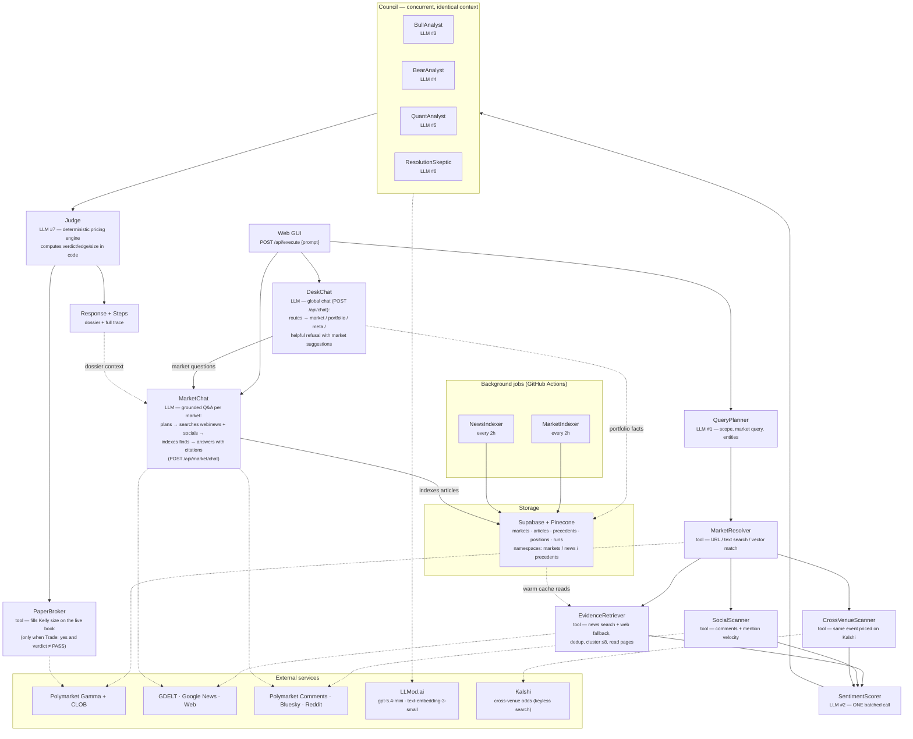

# Polymarkov — Architecture

One `/api/execute` run makes **exactly 7 LLM calls** (amber). Everything
else is deterministic code. Module names below are identical to the
`steps[]` trace and the PNG served at `/api/model_architecture`.

## The 7 LLM calls per execute

| # | Module | Job |
|---|---|---|
| 1 | `QueryPlanner` | prompt → structured research plan (or refusal) |
| 2 | `SentimentScorer` | ONE batched call scoring all news + posts |
| 3–6 | `BullAnalyst` `BearAnalyst` `QuantAnalyst` `ResolutionSkeptic` | concurrent council on one shared context |
| 7 | `Judge` | writes the dossier around numbers computed by code |

`MarketChat` sits outside the 7-call execute pipeline: each chat question
costs at most 2 LLM calls (a planner deciding whether fresh intel is needed,
then the grounded answer). Articles it gathers are indexed into Supabase and
embedded by the `NewsIndexer` on its next pass.

## Agent registry

Everything the agent can do is declared in one place —
[backend/agent/registry/](../backend/agent/registry/): `tools.py` holds the
formal spec of every module/tool (name, kind, inputs, outputs, data sources,
implementation path) and `prompts/` holds the system prompts, one `.txt` per
LLM module. `GET /api/agent_info` serves both verbatim.

## Guardrails

- **Code does all arithmetic** — the pricing engine ([backend/agent/pricing.py](../backend/agent/pricing.py))
  computes fair value, edge, verdict and Kelly size; the Judge cannot alter them.
- Evidence is treated as untrusted content; every claim must cite an evidence id.
- PASS is a first-class outcome; repeated requests are served from a 15-min dossier cache.

## Beyond the graded pipeline (autonomy layer)

Scheduled jobs reuse the same pipeline: `Sentinel` (perception) files agenda
items, `WorkAgenda` investigates and trades under risk rules, strategy jobs
(arbitrage / market making / copy trading / correlation graph) run under the
Strategy Desk toggles, and `DailyBriefing` reports it all each morning.
`jobs/watch_live.py` adds a real-time WebSocket sense when run persistently.
